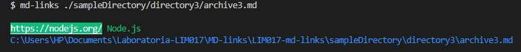
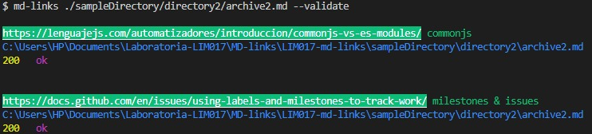
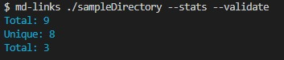

# Markdown Links

## Índice

* [1. Preámbulo](#1-preámbulo)
* [2. Resumen del proyecto](#2-resumen-del-proyecto)
* [3. Diagrama de flujo](#3-diagrama-de-flujo)
* [4. Instalación](#4-instalacion)
* [5. Instrucciones](#5-instrucciones)
* [6. Autor](#6-autor)

***

## 1. Preámbulo

Markdown es un lenguaje de marcado
ligero muy popular entre developers. Es usado en muchísimas plataformas que
manejan texto plano (GitHub, foros, blogs, ...), y es muy común
encontrar varios archivos en ese formato en cualquier tipo de repositorio
(empezando por el tradicional README.md).

Estos archivos markdown normalmente contienen _links_ (vínculos/ligas) que
muchas veces están rotos o ya no son válidos y eso perjudica mucho el valor de
la información que se quiere compartir.
## 2. Resumen del proyecto

`.md Links` es una herramienta de línea de comando (CLI) que se ejecuta en Node.js

`.md Links` va a leer y analizar archivos en formato markdown, para verificar los links que contengan y reportar algunas estadísticas.

## 3. Diagrama de flujo
Este es el digrama de flujo que se creó como punto de partida para empezar a construir `.md Links`, aquí el usuario tendrá mejor idea del trabajo interno que hará la librería despues de ingresar alguna ruta y opciones

## 4. Instalación
Para la instalar  `.md Links` el usuarios debe ejecutar la siguiente línea de comando en tu terminal:

`npm i md-links-thalia`

## 5. Instrucciones
con `.md Links` el usuario va a poder escribir diferentes argumentos o comandos en la terminal para obtener la información requerida. Va a poder trabajar con rutas y opciones.

5.1. Ingresando  md-links `path` , obtendrá por cada link encontrado:
`link` `texto del link`
`ruta absoluta donde se encontró el link`

Por ejemplo :

5.2. Ingresando md-links `path` y la opción `--validate`, obtendrá por cada Link encontrado:
`link` `texto del link`
`ruta absoluta donde se encontró el link`
`status del link` `mensaje ok , o de error si el link está roto`

Por ejemplo :

5.3. Ingresando md-links `path` y la opción `--stats`, obtendrá:
`total de liks encontrados`
`total de links únicos`

Por ejemplo :

5.4. Ingresando md-links `path` y las opciones `stats` y `--validate` obtendrá:
`total de liks encontrados`
`total de links únicos`
`total de liks rotos`

por ejemplo :

## 6. Autor

Thalia Román López

